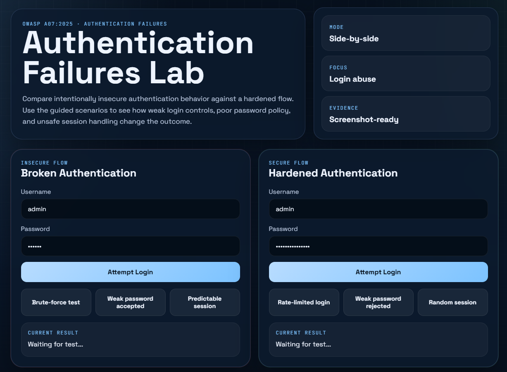
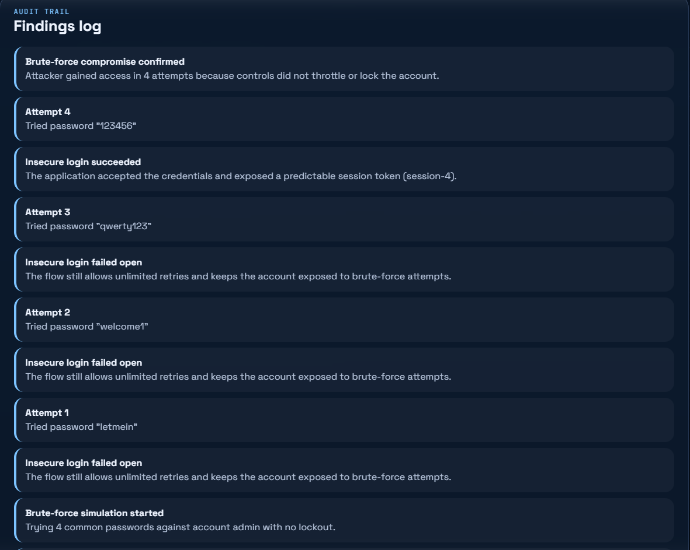
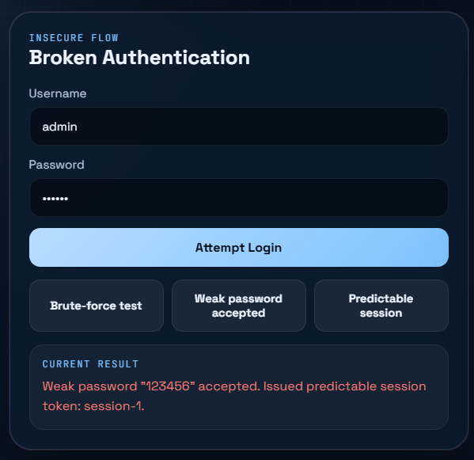
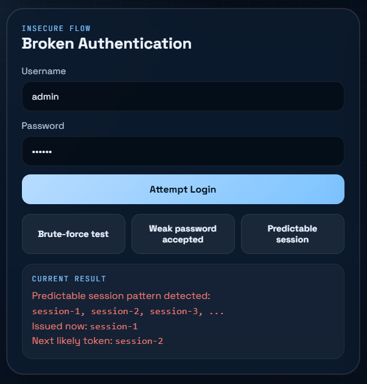
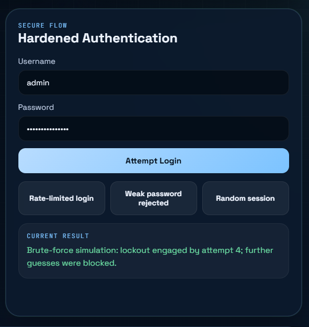
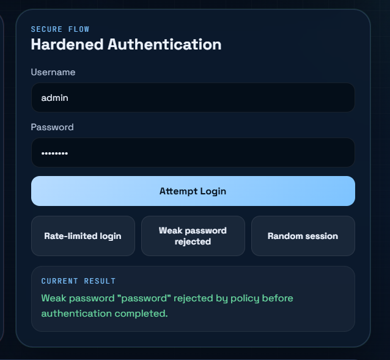
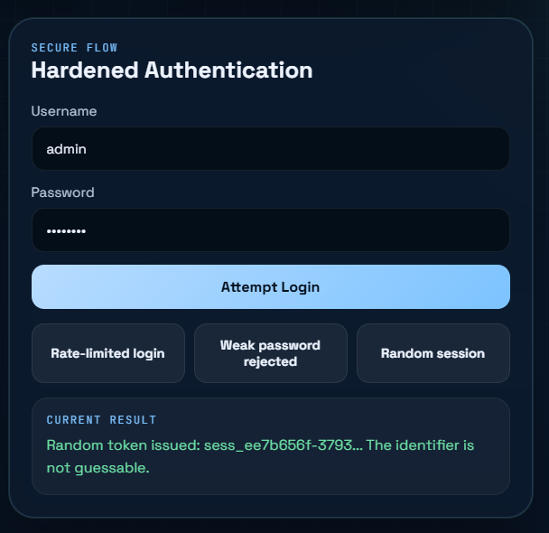

# Authentication Failures Vibe Coding Assignment

## Overview
I chose **GitHub Copilot in VS Code** because it let me build and revise the lab quickly while keeping the code, preview, and edits in one place. It was the fastest way to turn a security idea into a working demo that I could iterate on as I tested the authentication logic.

## Program Description
I built an **Authentication Failures Lab** as a small educational web app in HTML, CSS, and JavaScript. I chose this kind of program because authentication issues are easier to understand when you can compare insecure and secure behavior side by side. The app shows an intentionally weak login flow next to a hardened flow so the difference between unlimited retries, weak password acceptance, predictable sessions, lockout, password policy, and random session handling is easy to see.

The insecure side accepts weak credentials, allows repeated attempts, and can issue predictable session tokens. The secure side rejects weak passwords, rate-limits repeated failures, locks the account after several attempts, and generates a random session token on success.

## Vulnerability Explored
The vulnerability I explored was **Authentication Failures**, which includes weak password controls, missing rate limiting, lack of account lockout, and unsafe session generation. In practice, these mistakes make brute-force attacks, credential stuffing, and session prediction much easier.

There have been several recent real-world incidents tied to authentication weaknesses or stolen credentials. Examples include the **2024 Change Healthcare attack**, where compromised access helped attackers move into critical systems, and the **2024 Snowflake-related breaches**, where stolen credentials and missing MFA protections played a major role in customer account compromise. Earlier incidents such as the **MGM Resorts** and **Caesars** breaches also showed how weak identity controls and social engineering can lead to major business impact.

## Problems Encountered
The main problems I ran into were getting the secure flow to behave differently from the insecure flow without making the code confusing, making the lockout logic trigger at the right time, and ensuring the session token examples were clearly predictable in the insecure case and clearly random in the secure case. I solved those issues by separating the insecure and secure login functions, tracking attempt counts in shared state, and testing each scenario button until the results matched the written explanation.

## Testing and Findings
The lab confirmed that authentication weaknesses are often about control failure rather than just bad credentials. On the insecure side, unlimited retries and predictable session IDs made the system easy to abuse. On the secure side, weak passwords were rejected, repeated failures triggered lockout, and successful logins used random session tokens.

### Insecure Flow
- Weak passwords are accepted if the username matches.
- Repeated login attempts are allowed without lockout or throttling.
- Session identifiers can be predicted from the insecure token pattern.

### Secure Flow
- Weak passwords are rejected before authentication completes.
- Repeated failures trigger rate limiting and account lockout.
- Successful logins receive a random session token generated with `crypto.randomUUID()`, which I used here because it is an easy way to demonstrate high-entropy, non-predictable token generation in a browser-based lab.

## Evidence
### 1. Full app overview

Caption: This overview shows the side-by-side design of the lab, with the insecure flow on the left and the secure flow on the right, which makes control differences easy to compare.

### 2. Insecure brute-force scenario

Caption: This screenshot shows repeated password-guess attempts continuing without throttle or lockout, demonstrating that the insecure flow allows brute-force activity.

### 3. Insecure weak-password acceptance

Caption: This output explicitly shows a weak password being accepted by the insecure flow, proving the absence of effective password policy enforcement.

### 4. Insecure predictable session token

Caption: The result panel displays an incrementing token sequence and the next likely token value, showing that session identifiers are predictable and vulnerable to guessing.

### 5. Secure weak-password rejection

Caption: This screenshot shows the secure flow rejecting a weak password before authentication succeeds, confirming that password complexity policy is enforced.

### 6. Secure lockout/rate-limit behavior

Caption: This evidence shows repeated failed attempts triggering lockout/rate limiting, which prevents further credential guessing after the threshold is reached.

### 7. Secure random session token

Caption: The secure flow issues a high-entropy token generated with random UUID logic, demonstrating a non-sequential session identifier that resists prediction.

## Conclusion
This demo showed that secure authentication depends on multiple controls working together: strong password policy, rate limiting, account lockout, and unpredictable session handling. Even a simple lab makes it clear that when any one of those controls is missing, attackers gain a much easier path to compromise.