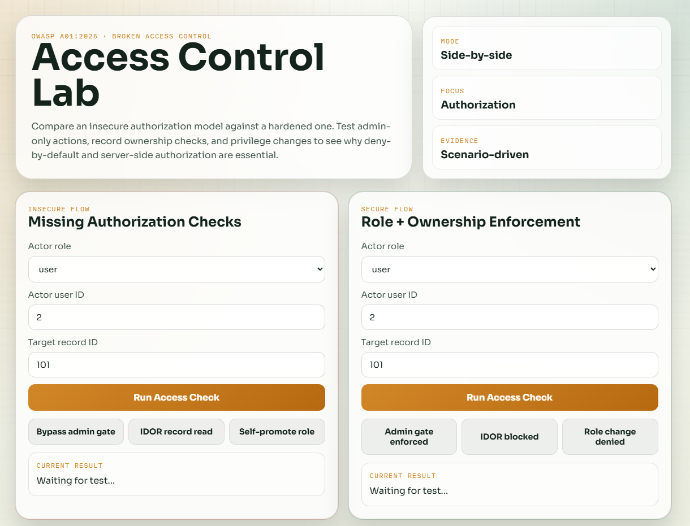
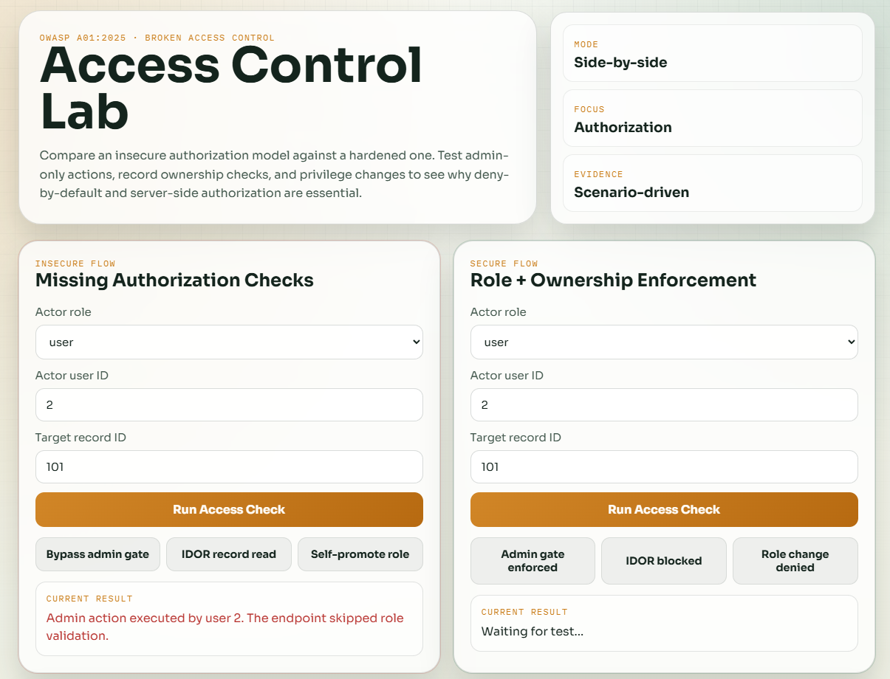
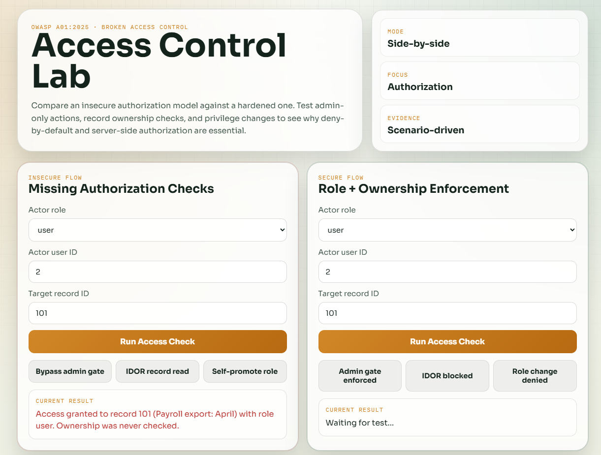
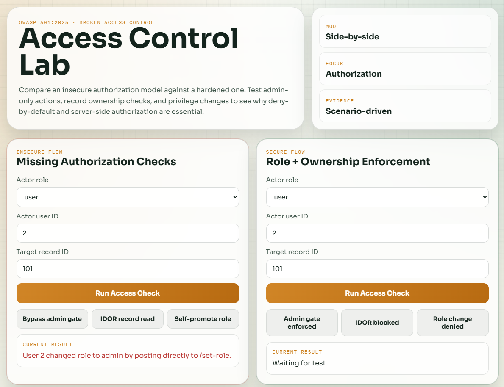
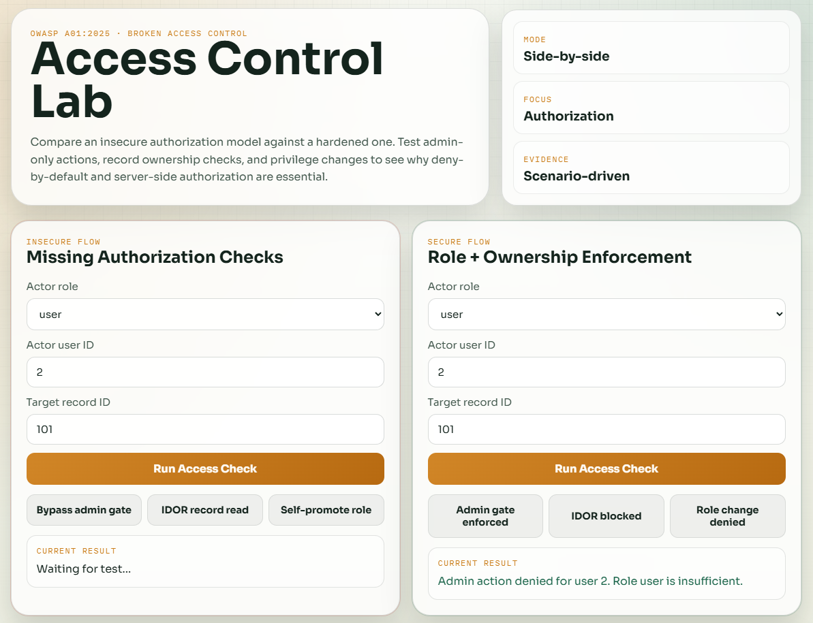
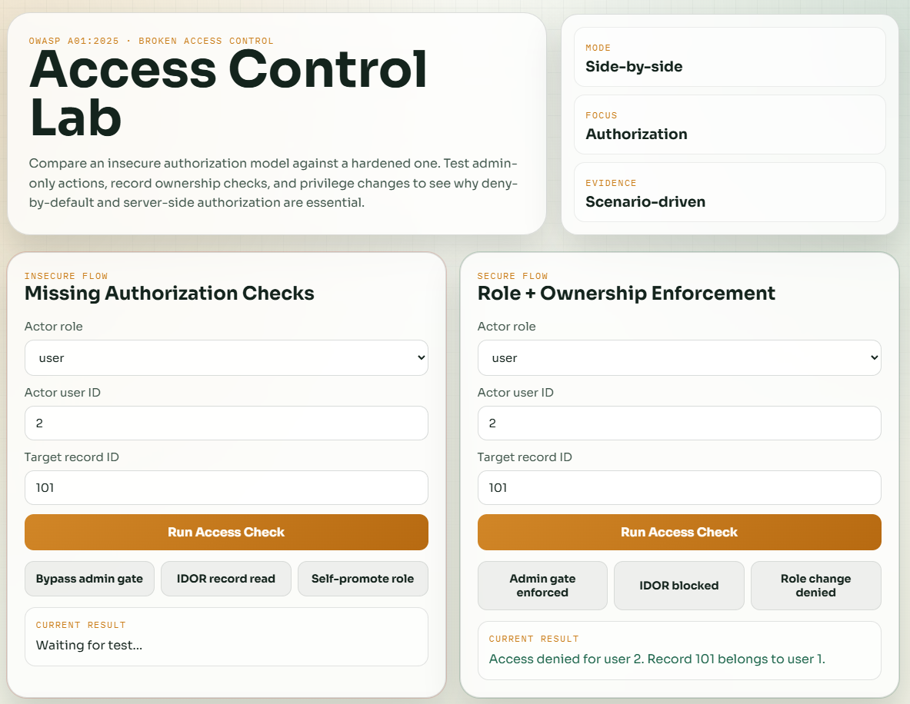
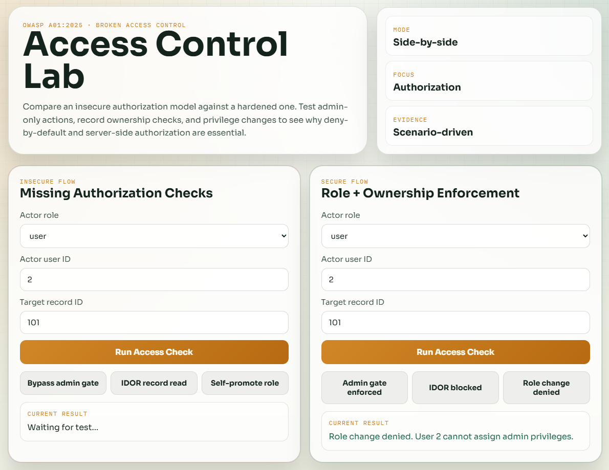

# Broken Access Control Vibe Coding Assignment

## Overview
I chose GitHub Copilot in VS Code because it allowed me to rapidly prototype, test, and revise this lab in one place. I reused the side-by-side style from my first vibe coding assignment so I could focus on demonstrating authorization logic clearly instead of spending time on setup.

## Program Description
I built a Broken Access Control Lab as a small educational web app in HTML, CSS, and JavaScript. I chose this type of program because access control issues are easiest to understand when the insecure and secure behavior can be tested side by side. The program compares an insecure flow against a secure flow for the same actions:
- admin-only action access
- object-level access to user records (IDOR-style behavior)
- role/privilege changes

I chose this format because access control failures are easiest to understand when users can trigger the same scenario in both vulnerable and hardened implementations and immediately compare outcomes.

## Vulnerability Explored
The vulnerability explored is OWASP A01:2025 Broken Access Control. This category includes missing server-side authorization checks, insecure direct object references, and privilege escalation paths that allow users to perform actions outside their intended permissions.

Recent real-world incidents commonly involve unauthorized access patterns, including exposed internal dashboards, weak API authorization checks, and object ID enumeration issues where users can view or modify data belonging to other accounts.

In this lab:
- The insecure flow trusts user input and allows unauthorized admin action execution.
- The insecure flow allows reading another user’s record by changing object ID values.
- The insecure flow allows role escalation through an unprotected role-change action.
- The secure flow enforces role checks, ownership checks, and deny-by-default behavior.

## Problems Encountered
The main problems I ran into were making the vulnerability behavior obvious without a backend service, keeping the secure and insecure flows directly comparable, and balancing realism with assignment scope. I solved these issues by using a small in-memory dataset, adding deterministic scenario buttons for repeatable testing, and focusing on three practical access control patterns: admin bypass, IDOR, and privilege escalation.

## Testing and Findings
### Insecure Flow Findings
- A non-admin user can execute an admin-only action.
- A non-owner can read another user’s record by selecting a different record ID.
- A regular user can self-promote to admin.

### Secure Flow Findings
- Admin-only actions are blocked for non-admin users.
- Object access is limited to owner or admin roles.
- Privilege change operations are denied unless the actor is already authorized.

## Evidence
### 1. Full app overview

Caption: This overview shows the side-by-side design of the lab, with the insecure flow on the left and the secure flow on the right, so authorization differences are easy to compare.

### 2. Insecure admin-only action bypass

Caption: This screenshot shows a non-admin user successfully executing an admin-only action in the insecure flow because role checks are missing.

### 3. Insecure IDOR record access

Caption: This output shows a user reading another user's record by changing the target record ID, demonstrating insecure direct object reference behavior.

### 4. Insecure privilege escalation

Caption: This evidence shows a regular user self-promoting to admin through an unprotected role-change action.

### 5. Secure admin action denied for non-admin user

Caption: This screenshot shows server-side role enforcement correctly blocking admin-only operations for a non-admin user.

### 6. Secure IDOR blocked by ownership check

Caption: The secure flow denies access when the actor is neither the owner nor an admin, preventing object-level unauthorized access.

### 7. Secure authorized access success

Caption: This screenshot shows a valid authorized path where access is granted only after role and/or ownership checks pass.

## Conclusion
This assignment showed that Broken Access Control often happens when applications trust client-side data or skip server-side checks. A small lab can clearly demonstrate how deny-by-default authorization, role checks, and resource ownership checks prevent unauthorized access and privilege escalation.
