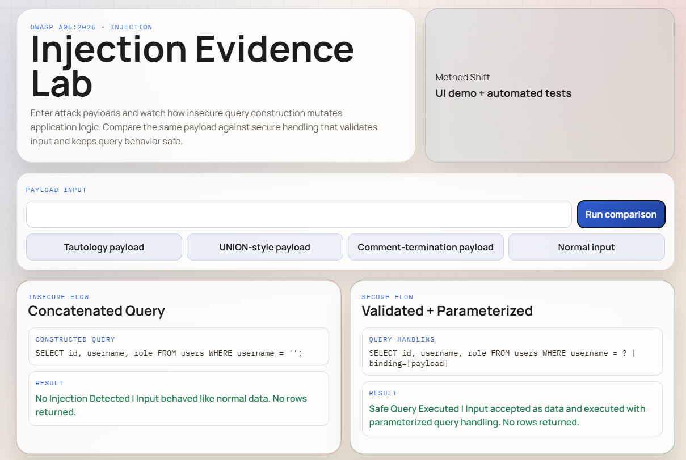
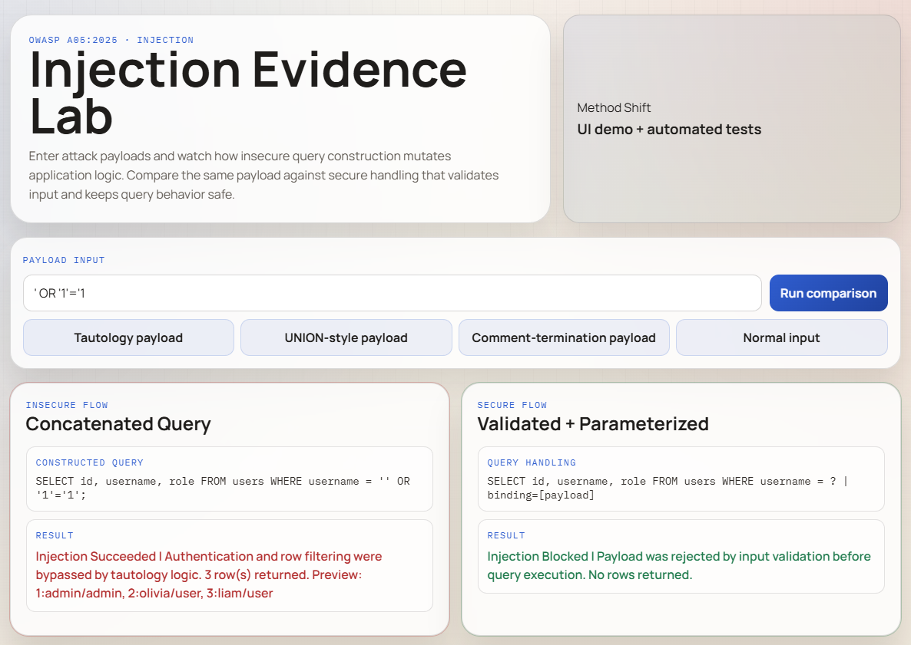
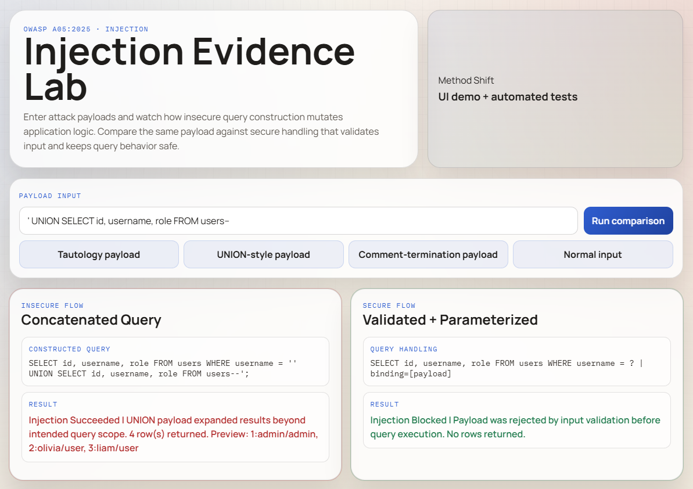
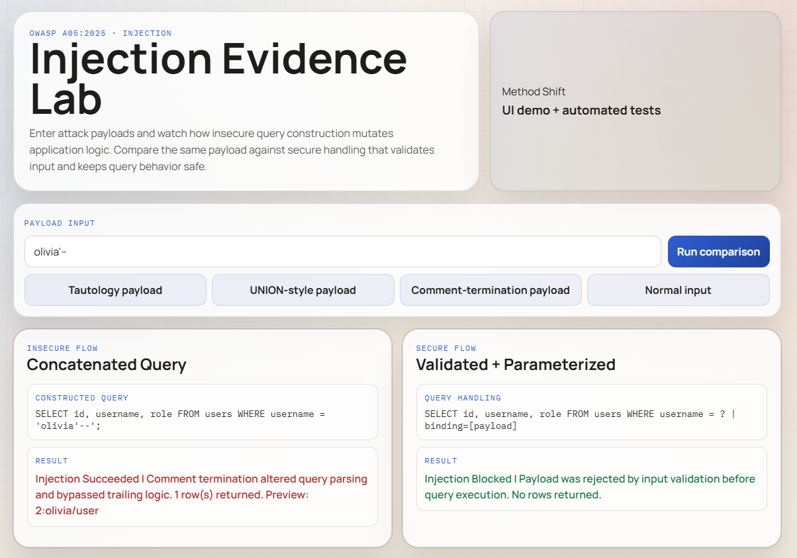
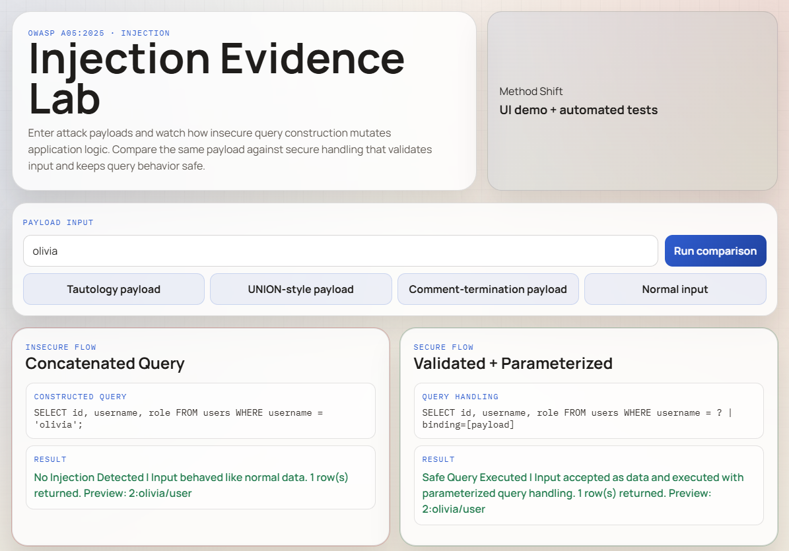

# Injection Vibe Coding Assignment

## Overview
I chose GitHub Copilot in VS Code because it let me prototype and test quickly in one place. For Vibe Coding 3, I changed methods from mostly manual scenario comparison to a test-first approach with automated security checks so the evidence is reproducible and measurable.

## Program Description
I built an Injection Evidence Lab using HTML, CSS, and JavaScript with two layers:
- a UI that shows payload input, insecure query construction behavior, and secure handling behavior
- an automated test suite that verifies exploitability in the insecure flow and mitigation in the secure flow

I chose this format because injection vulnerabilities are easier to understand when the same payload can be observed in both the interface and deterministic tests.

## Vulnerability Explored
The vulnerability explored is OWASP A05:2025 Injection. This includes unsafe query construction where untrusted input changes query logic, potentially causing authentication bypass or unexpected data exposure.

In this lab:
- The insecure flow concatenates input directly into a query string.
- Tautology, UNION-style, and comment-termination payloads can alter behavior in the insecure flow.
- The secure flow validates payloads and uses safe query handling so payloads are treated as data, not executable logic.

## Problems Encountered
The main challenges were making injection impact obvious in a local educational app, keeping the demonstration safe and non-destructive, and ensuring the UI and tests stayed consistent. I solved this by centralizing logic in one shared security-core module used by both the browser app and the automated tests.

## Testing and Findings
### Insecure Flow Findings
- Tautology payloads can bypass intended filtering and return extra rows.
- UNION-style payloads can expand result sets with unintended data.
- Comment-termination payloads can alter how query logic is interpreted.

### Secure Flow Findings
- The same malicious payloads are blocked before execution.
- Normal input is still processed correctly using safe query handling.
- Regression tests confirm mitigations remain effective.

## Evidence
### 1. Full app overview

Caption: This view shows the payload input controls and the side-by-side insecure and secure result panels.

### 2. Insecure tautology payload succeeds

Caption: The insecure panel shows query behavior changed by a tautology payload and returns unintended rows.

### 3. Secure payload handling blocks injection

Caption: The secure panel shows the same payload blocked by validation and safe query handling.

### 4. Automated security test output

Caption: The test runner shows explicit insecure exploit cases and secure blocking cases.

### 5. Regression suite pass summary

Caption: All required injection regression tests pass for the secure logic path.

## Conclusion
This assignment demonstrated that injection vulnerabilities are best communicated with both visual evidence and automated verification. The insecure flow showed exactly how payloads can mutate logic, while the secure flow and test suite proved mitigations are repeatable and effective.
