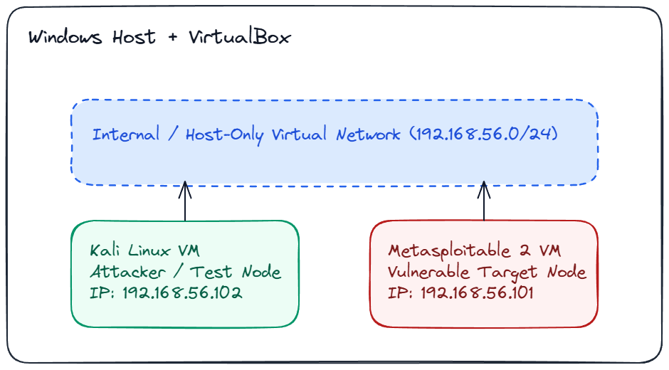
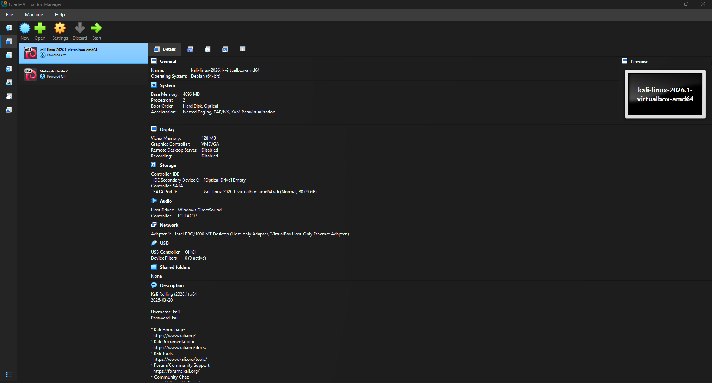
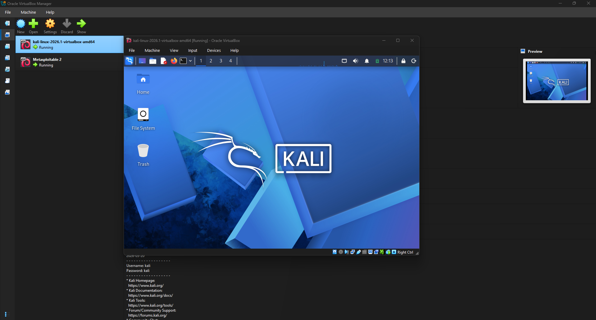
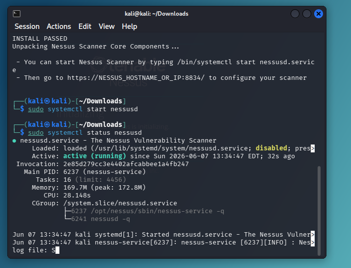
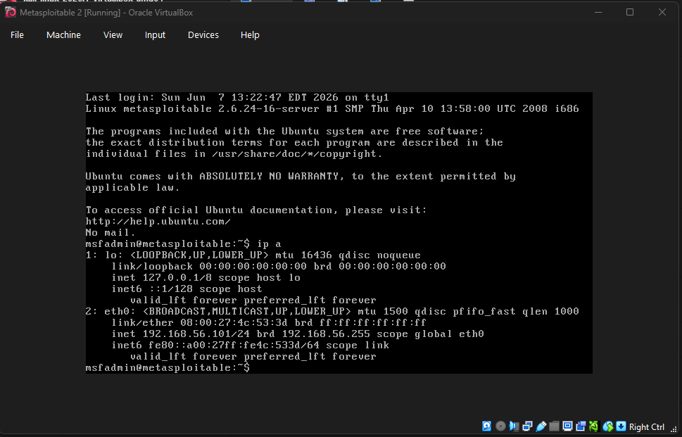
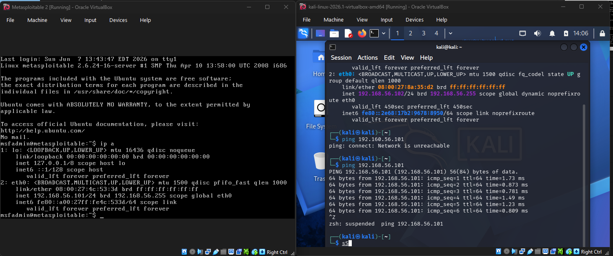

# Project 1: Penetration Testing Lab Setup

## Overview
This project documents a local penetration testing lab built on a Windows host using VirtualBox. The lab includes two virtual machines on an isolated virtual network: a Kali Linux attacker VM and a Metasploitable 2 target VM.

The lab objective is to establish a safe, repeatable environment for security testing activities required in later course assignments.

## Technology Stack
- Host OS: Windows
- Hypervisor: Oracle VirtualBox
- Attacker VM: Kali Linux
- Target VM: Metasploitable 2
- Vulnerability Scanner: Nessus Essentials
- Network model: Internal virtual network between attacker and target

## Architecture Diagram



## Setup Summary
### 1. VirtualBox Base Configuration
- Installed VirtualBox on Windows host.
- Imported/created Kali Linux and Metasploitable 2 VMs.
- Allocated CPU, RAM, and disk resources appropriate for dual-VM operation.


### 2. Network Configuration
- Configured both VMs on a shared internal or host-only network.
- Assigned or confirmed IP addresses on the same subnet.
- Verified both VMs can boot and maintain network connectivity.

### 3. Kali Linux Validation
- Booted Kali Linux VM and logged in successfully.
- Opened terminal and validated networking with IP and route checks.

Reference commands used:

```bash
ip addr
ip route
ping -c 4 <metasploitable_ip>
```



### 4. Nessus Installation Validation
- Installed Nessus Essentials on Kali Linux.
- Started Nessus service and opened Nessus web UI.
- Confirmed plugin initialization and scanner availability.

Reference command example:

```bash
sudo systemctl status nessusd
```


### 5. Metasploitable 2 Validation
- Booted Metasploitable 2 VM and confirmed it reached login prompt.
- Confirmed target VM IP address for testing from Kali.



## Connectivity Validation
From Kali Linux, ping test to Metasploitable 2 succeeded.

Capture this evidence in a terminal screenshot and include:
- destination IP
- packet count and replies
- summary line showing packet loss



## Problems Encountered and Resolutions

### Issue 1
- Problem: VM network adapter was attached to the wrong network type, so Kali could not reach Metasploitable.
- Resolution: Set both adapters to the same host-only/internal network and renewed addresses. I had originally set Kali to NAT so that I could download Nessus but forgot to switch it back.

### Issue 2
- Problem: Nessus service did not appear usable after installation.
- Resolution: Verified service state, restarted service, and re-opened the local Nessus URL. The service had not finished compiling plugins yet during the initial setup.

## Final State
The lab is operational with:
- Kali Linux running as attacker VM
- Metasploitable 2 running as target VM
- Basic network connectivity verified from Kali to target
- Nessus installed and available for vulnerability scanning

This environment is ready for Week 6 and Week 8 penetration testing assignments.