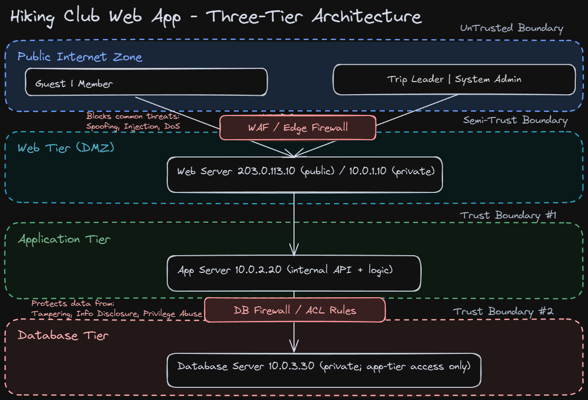

# Project 2: Secure Design Document & Threat Model Assessment

## Hiking Club Web Application

**Course:** MSSE642  
**Project:** Project 2 - Threat Analysis  
**Author:** William Priddy  
**Date:** 27 June 2026  

---

## Part 1: Secure Design Document

### 1.1 Project Description

The Hiking Club Web Application supports hiking-event management for multiple roles with different permissions and responsibilities.

The application includes four user roles:
- Guest: can view public upcoming events without authentication
- Member: can register for events and edit their personal profile
- Trip Leader: can create and manage trips
- System Admin: can manage user accounts and access financial tools

The system handles sensitive operational and personal data, including member profile records and payment-related data.

The application architecture uses a cloud-based three-tier deployment. The backend database is on a protected private network and is not directly exposed to public internet traffic.

The organization depends on this platform as its primary operating system for event scheduling, member coordination, and payment collection. Any prolonged outage, data breach, or role-boundary failure would directly impact member safety, trust, and the club's ability to operate trips.

### 1.2 Organization Description

The Hiking Club is a volunteer-led nonprofit organization that coordinates outdoor trips for members with different fitness levels. The club relies on a web-first operating model, with most member onboarding, trip registration, and payment workflows managed through the application.

Operationally, the platform is maintained by a small admin group with limited IT staffing. This creates a realistic security constraint: controls must be strong enough to protect sensitive data while still being manageable by a small team.

The application is mission-critical because it is the club's central coordination system. If the platform is unavailable, members cannot register for trips, leaders cannot manage attendance, and administrators cannot manage financial workflows.

Because the system stores credentials, personal profile data, medical notes, and payment-related information, the organization has practical security obligations similar to a small business handling sensitive personal and financial data.

### 1.3 Deployment Environment

**Selected model:** Cloud three-tier (web + app + DB)

The application is deployed as three logical tiers with clear trust boundaries:
- Web tier (public-facing): hosts the UI and accepts internet traffic over HTTPS
- Application tier (private/internal): processes business logic, authentication, and authorization checks
- Database tier (private/internal): stores user, event, and payment-related records and accepts traffic only from the application tier

Network and platform controls:
- Firewall/security groups: internet traffic is restricted to required web ports on the web tier; only internal allow-list traffic is permitted from web to app and app to database tiers
- TLS/HTTPS: all client-to-web and inter-service traffic uses encrypted channels
- Secrets and keys: credentials and API secrets are stored in managed secret storage with role-based retrieval and rotation policy
- Logging/monitoring: authentication events, privileged actions, and data-access events are captured centrally with alerting on suspicious patterns

#### Infrastructure Summary

| Component | Public Address | Private Address | Notes |
|---|---|---|---|
| Web Server | 203.0.113.10 | 10.0.1.10 | Public entry point for UI and authenticated sessions |
| App Server | None | 10.0.2.20 | Internal API and business logic layer |
| Database Server | None | 10.0.3.30 | Private data store, reachable only from app tier |
| Client Browsers | Varies | N/A | Guest, Member, Trip Leader, and System Admin access |

### 1.4 Secure Concepts Applicable to the Application

#### Authentication and Credential Security
- Enforce strong password policy
- Add rate-limiting and account lockout
- Add MFA for privileged roles
- Require server-side credential validation and secure password hashing
- Monitor failed login patterns to detect brute-force and credential-stuffing behavior

#### Authorization and RBAC
- Enforce role boundaries server-side
- Prevent horizontal and vertical privilege escalation
- Restrict financial/admin tools to System Admin
- Validate role and resource ownership on every protected endpoint
- Prevent role changes from client-side requests without server-side administrative approval

#### Sensitive Data Protection
- Protected data classes in scope:
  - Credentials
  - PII
  - Medical/health data
  - Payment/financial data
- Encrypt sensitive data at rest and in transit
- Restrict data access by least privilege
- Apply field-level access controls for medical and payment-related records
- Separate backup storage and enforce backup access controls

#### Logging, Monitoring, and Auditability
- Log authentication events and privileged actions
- Log data access on sensitive records
- Protect logs from tampering
- Retain immutable audit trails for account updates, role changes, and financial actions
- Add periodic review of audit logs for anomalies and policy violations

#### Out of Scope
- Physical security of cloud provider facilities
- Third-party payment processor internals (integration points only are in scope)
- Endpoint compromise on user-owned devices
- Social engineering outside application-managed controls
- Supply-chain vulnerabilities in upstream provider infrastructure
- Disaster recovery activities outside app-defined backup and restore scope

---

## Part 2: Hiking Club Threat Model Assessment

### Deliverable 2A: Architecture Diagram

Diagram source file:
- ../images/HikingClub_Diagram.excalidraw

### Deliverable 2B: STRIDE Threat Model

#### 1. Spoofing - Impersonation of Legitimate Users

Spoofing is a high-priority risk because attackers can attempt account takeover through weak credentials, credential stuffing, or phishing-style impersonation of login workflows. If successful, attackers can access member records or privileged administration features using a legitimate identity context.

Potential mitigations:
- MFA for privileged roles
- Credential stuffing defenses and rate limits
- Session protection and secure cookie settings
- Authentication event alerting

#### 2. Tampering - Unauthorized Modification of Data

Tampering can occur when attackers manipulate requests, IDs, or input fields to alter event registrations, profile details, attendance records, or payment metadata. This threatens data integrity and can directly affect safety and financial trust.

Potential mitigations:
- Input validation and parameterized queries
- Integrity controls and change logging
- Strict server-side authorization checks

#### 3. Repudiation - Denial of Performed Actions

Repudiation is lower priority than spoofing or disclosure, but still relevant. Without reliable logs, users or admins may deny making high-impact changes such as schedule updates, account edits, or financial actions.

Potential mitigations:
- Immutable audit logs
- Time-stamped action trails for sensitive operations
- Access review and log retention policy

#### 4. Information Disclosure - Exposure of Confidential Data

Information disclosure is a top-tier risk because the system stores PII, medical notes, and payment-related data. Weak access controls, insecure backups, or misconfigured endpoints could expose confidential member information.

Potential mitigations:
- Encryption at rest and in transit
- Field-level access control
- Backup and log access restrictions

#### 5. Denial of Service - Disruption of Availability

Denial of service can block member registration windows, leader trip updates, and admin operational actions. Since the web application is the club's operational center, prolonged outages create immediate business and coordination impact.

Potential mitigations:
- WAF and rate limits
- DDoS protection
- Incident response and recovery testing

#### 6. Elevation of Privilege - Unauthorized Access Level Increase

Elevation of privilege can occur if role checks are inconsistent between UI and backend endpoints. Potential abuse paths include Guest to Member page access, Member invoking Trip Leader actions, or Trip Leader accessing System Admin finance controls.

Potential mitigations:
- Server-side RBAC enforcement on every protected endpoint
- Least privilege role design
- Routine privilege boundary testing

### Deliverable 2C: OWASP Threat Model

#### 1. Assessment Scope - What Is at Risk?

Assets in scope:
- Credentials and authentication workflows
- PII and member profile data
- Medical and health-related member data
- Payment and financial workflow data
- Availability of registration and management workflows
- Administrative integrity of role assignments and audit logs

#### 2. Vulnerabilities - What Are the Key Weaknesses?

Map to OWASP Top 10 categories (selected set):
- A01: Broken Access Control
- A02: Cryptographic Failures
- A03: Injection
- A05: Security Misconfiguration
- A07: Identification and Authentication Failures
- A09: Security Logging and Monitoring Failures

System-specific vulnerability notes:
- A01 Broken Access Control: endpoint-level authorization gaps could allow cross-role access
- A02 Cryptographic Failures: insufficient encryption of sensitive fields or backups increases disclosure risk
- A03 Injection: unsanitized input in search, profile, or admin workflows may enable query or command manipulation
- A05 Security Misconfiguration: overly permissive network rules or default settings can expose internal services
- A07 Identification and Authentication Failures: weak password policy and missing MFA increase account takeover risk
- A09 Logging and Monitoring Failures: missing audit coverage limits detection of unauthorized actions

#### 3. Countermeasures - What Should Be Implemented?

The following controls are prioritized to reduce the highest identified risks while remaining feasible for a small operational team.

Suggested structure:
- Authentication hardening: strong password policy, account lockout, rate limiting, MFA for privileged roles
- Authorization hardening: server-side RBAC checks on all protected endpoints, ownership checks, least-privilege role review
- Data protection controls: encryption in transit and at rest, restricted backup access, minimized sensitive field exposure
- Logging and monitoring controls: immutable audit trails for auth and privileged actions, alerting for anomaly patterns
- Availability controls: WAF/rate controls, DDoS mitigation, recovery playbooks and backup validation testing

#### 4. Prioritized Risks - Ranked List

Based on your confirmed ordering:

| Rank | Risk |
|---|---|
| 1 | Spoofing |
| 2 | Information Disclosure |
| 3 | Tampering |
| 4 | Elevation of Privilege |
| 5 | Denial of Service |

Supporting rationale:
- Spoofing is ranked first due to direct account takeover potential.
- Information disclosure is ranked second because exposed medical and financial data create high confidentiality impact.
- Tampering is ranked third due to potential integrity loss in trip and payment records.
- Elevation of privilege is ranked fourth based on role-boundary abuse potential.
- Denial of service is ranked fifth due to operational disruption risk and mitigations typically available at platform level.