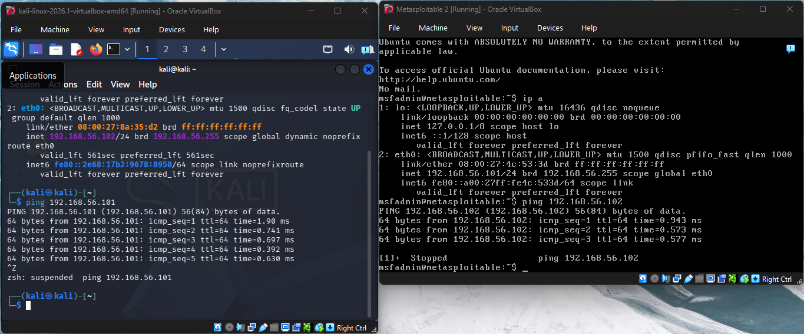
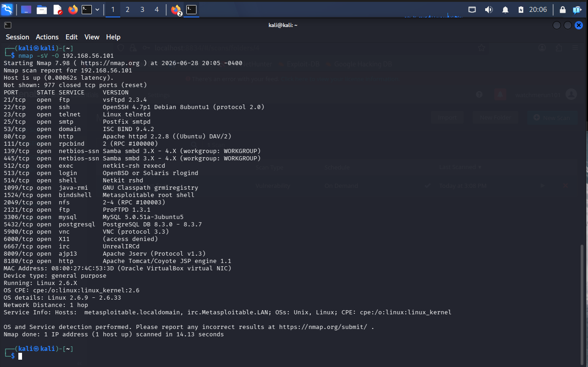
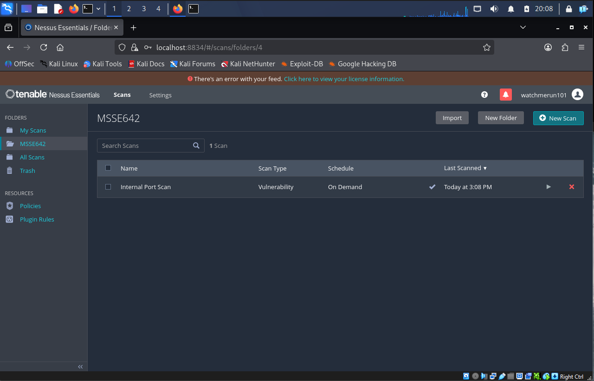
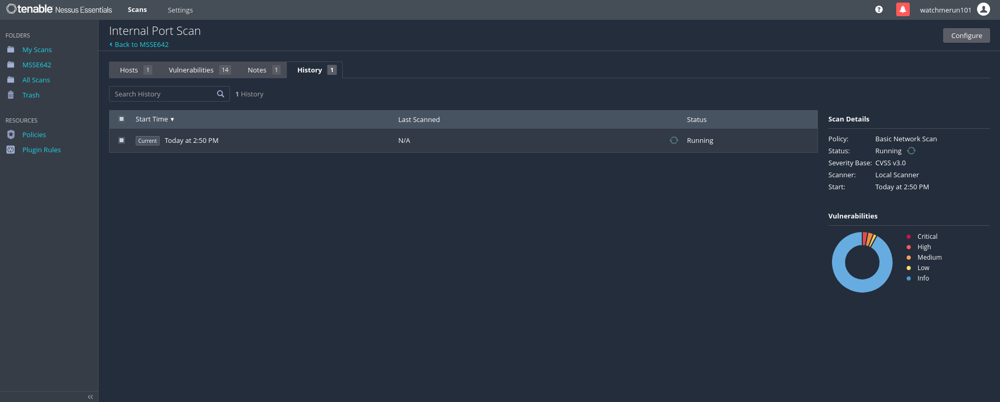
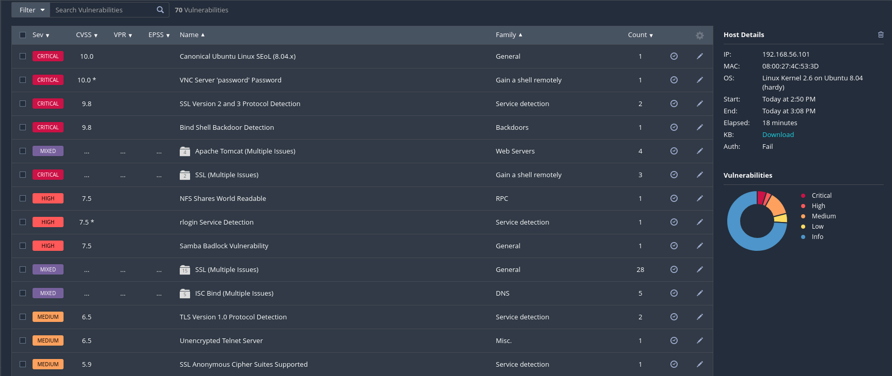

# Project 3 - Penetration Testing Lab 1

## Overview

Project 3 documents the application security testing work completed in the isolated lab environment created earlier in the course. The goal is to use OWASP-aligned testing methods to identify security weaknesses in 2-3 targets, capture evidence, and prepare the work for continued analysis in Week 7.

The document is organized into three parts to match the style of the completed project draft provided by my teammate while still reflecting the testing and reporting expectations for this course.

## Purpose

The purpose of this project is to practice practical penetration testing workflow: confirm the lab is functioning, map the exposed services on the target host, and research the vulnerability assessment tools used to prioritize findings.

## Scope

This project stays within the lab environment and focuses on application-facing services and vulnerable web applications. In scope are web endpoints, exposed services, authentication behavior, basic input handling, and scan results from tools such as Nikto and Nessus.

Out of scope are destructive actions, production systems, denial-of-service testing, and anything outside the isolated lab network.

## Environment and Tools

| Component | Role |
|---|---|
| Kali Linux VM | Attacking and testing workstation |
| Metasploitable 2 | Vulnerable target host |
| Host-only or isolated network | Safe lab connectivity |
| Nessus Essentials | Vulnerability discovery and prioritization |

## Part 1 - Getting the Lab Running

The first step in the project was confirming that the virtual machines were powered on, connected to the same isolated network, and reachable from the Kali workstation. This establishes the baseline for all later testing because the scan and research phases depend on stable lab connectivity.

Evidence from the earlier setup work is kept in the `images/` folder and can be referenced directly in the write-up:

| Evidence | Description |
|---|---|
|  | Confirms the lab host and target environment are available and communicating |
|  | Confirms the vulnerability scanner is available for use |

The lab setup stage is complete when both systems are running, reachable, and ready for service enumeration.

## Part 2 - Port Scan of Metasploitable 2

Once the lab was confirmed to be stable, the next step was to enumerate the exposed services on Metasploitable 2. The purpose of this scan is to identify what is listening, which ports are exposed, and which services are worth deeper manual review.

This scan phase is the foundation for the remainder of the project because it turns a live host into a concrete test plan. The results guide which web services are most relevant, which tools should be used next, and where the likely security weaknesses are concentrated.

The scan workflow for this stage is:

1. Run a port scan against the target host.
2. Record open services, versions, and any banners that are exposed.
3. Review the results for obvious web-facing attack surface.
4. Save the results for later reference in the report and continuation work.

This stage also supports later testing with Nikto and OWASP ZAP because it identifies the specific web services that should be crawled and checked for misconfiguration.

## Part 3 - Nessus Research

### Introduction

Nessus is a vulnerability scanning tool developed by Tenable that fingerprints services and compares them against a large database of known weaknesses. Rather than manually probing every service one at a time, Nessus automates much of the initial discovery and helps prioritize which issues deserve closer attention.

### Big Picture

Nessus fits into the vulnerability analysis phase of the penetration testing process. It is useful after the initial port scan because it adds severity ratings, plugin-based findings, and a clearer picture of which services are most likely to be vulnerable.

For this project, Nessus is part of the decision-making process rather than the final answer by itself. Its output helps confirm where manual testing should focus and which findings should be carried forward into the Week 7 continuation work.

### Lab

Nessus is available in the lab environment and was confirmed during the setup stage. The installed scanner can be used against the Metasploitable target to collect vulnerability data, compare service versions against known issues, and support the later write-up of findings.

The most useful outputs from Nessus are the severity summary, plugin details, and any recommendations for remediation or re-testing. Those results are intended to be stored with the rest of the project evidence in `images/`.

### Conclusion

Nessus is a practical tool for turning a basic service inventory into a prioritized security assessment. For Project 3, it supports the move from reconnaissance to vulnerability analysis and helps structure the remainder of the lab testing work.