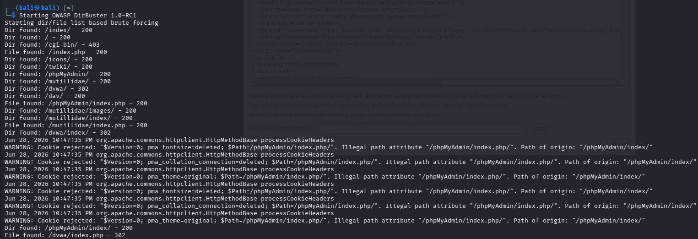

# Project 4 - Penetration Testing, Part 2

## Overview
Project 4 extends the Project 3 penetration testing workflow with advanced testing continuation, remediation planning, and mitigation retesting. This submission is aligned with my group's Hiking Club scenario and focuses on protecting sensitive member medical details, payment information, and profile data.

The Hiking Club application in this report is a theoretical case study scenario. The procedures, findings, and evidence links below are documented as a structured testing plan unless otherwise updated with real lab execution outputs.

## Scope and Objectives
### Scope
- In scope: lab-based testing of web authentication, profile forms, and payment-related routes.
- In scope: information gathering validation, vulnerability analysis, remediation planning, and retest verification.
- Out of scope: production targets, destructive exploitation, denial-of-service testing.

### Objectives
1. Continue advanced testing from Project 3 with deeper web-focused validation.
2. Prioritize vulnerabilities based on exploitability and data sensitivity.
3. Recommend and validate hardening actions.
4. Document evidence for findings, remediation, and retest outcomes.

## Environment and Tools
| Tool/Component | Usage in Project 4 |
|---|---|
| Kali Linux VM | Security testing workstation |
| OWASP ZAP | Intercepting proxy, vulnerability detection, and request analysis |
| DirBuster | Discovery of hidden content and administrative routes |
| Nessus Essentials | Supplemental scanner output and severity guidance |
| Isolated lab network | Controlled, ethical testing environment |

## Part 1: Website Penetration Testing Procedure

### Summary Table
| Testing Phase | Objective | Tools |
|---|---|---|
| Website Penetration Testing: Information Gathering (Ch 14) | In this phase, the penetration tester collects as much information as possible about the Hiking Club web application before attempting any attacks. This includes identifying the web server technology, frameworks, directories, hidden pages, and user input fields. For the Hiking Club, this is especially important given that it stores sensitive member data including medical conditions, payment information, and fitness notes. The goal is to map out the attack surface before any active testing begins. | DirBuster |
| Website Penetration Testing: Gaining Access (Ch 15) | In this phase, the penetration tester attempts to exploit vulnerabilities discovered during the information gathering phase. For the Hiking Club, this includes testing for SQL injection on the login and payment portal, cross-site scripting (XSS) on member profile fields, and brute force attacks on the authentication page (which the club has already been compromised by once). The goal is to simulate what a real attacker would do to gain unauthorized access to sensitive member data. | OWASP ZAP |

### Tool Description and Analysis

#### DirBuster

**Vendor Website:** [https://www.kali.org/tools/dirbuster/](https://www.kali.org/tools/dirbuster/)

DirBuster is a multi-threaded Java application designed to brute force directories and file names on web servers. It works by sending HTTP requests to a target web server using a wordlist of common directory and file names, revealing hidden or unlinked pages that may not be publicly accessible. This makes it particularly useful for uncovering administrative panels, backup files, or configuration files left exposed on the server.

DirBuster is included in the default installation of Kali Linux 2019 and can be launched directly from the application menu.

For the Hiking Club application, DirBuster would be used to map out all directories and files on the web server, including any hidden admin panels used by administrators to manage members, trips, and payments. Since the Hiking Club stores sensitive data such as medical conditions and payment history, discovering unprotected or misconfigured directories could reveal serious vulnerabilities. For example, an exposed `/admin` or `/payments` directory could allow an attacker to access or modify member data without authentication.

---

#### OWASP ZAP

**Vendor Website:** [https://www.zaproxy.org/](https://www.zaproxy.org/)

OWASP ZAP (Zed Attack Proxy) is a free, open-source web application security scanner maintained by the Open Web Application Security Project (OWASP). It acts as a proxy between the browser and the web application, intercepting and analyzing all traffic to identify security vulnerabilities such as SQL injection, cross-site scripting (XSS), and broken authentication. ZAP includes both automated scanning and manual testing tools, making it suitable for both beginners and experienced penetration testers.

OWASP ZAP is included in the default installation of Kali Linux 2019.

For the Hiking Club application, OWASP ZAP would be used to perform both automated and manual penetration testing on the authentication page, member profile forms, and payment portal. Given that the club was previously compromised via a brute force attack on the login page, ZAP's authentication testing features would be particularly valuable. Additionally, ZAP's active scanner would test all input fields — such as member registration forms and trip leader notes — for SQL injection and XSS vulnerabilities that could expose confidential medical information or payment data stored in the system.

## Part 2: Remediation and Security Hardening

Proposed findings from the penetration testing procedure were translated into specific remediation actions including stronger authentication controls, safer database query handling, and tighter input validation and output encoding. Hardening priorities were driven by the sensitivity of Hiking Club member data.

## Part 3: Retesting and Validation

Retesting is planned to verify whether identified weaknesses are reduced or resolved after remediation. Pre-fix and post-fix comparisons should be captured to support status updates and residual risk tracking once execution evidence is available.

## Proposed Findings and Risk Summary
| Finding ID | Area | Description | Initial Severity | Post-Remediation Severity | Status |
|---|---|---|---|---|---|
| F-01 | Authentication | Login controls may allow repeated attempts without strong lockout response. | High | Medium | Planned Retest |
| F-02 | Input Validation | Profile/payment input handling may allow potentially unsafe payload behavior. | High | Low | Planned Retest |
| F-03 | Route Exposure | Route discovery may expose sensitive endpoints requiring stricter access controls. | Medium | Low | Planned Retest |

## Proposed Remediation Actions
| Finding ID | Action | Retest Method | Result |
|---|---|---|---|
| F-01 | Add stronger lockout thresholds, rate limiting, and monitoring alerts. | Repeat auth stress test workflow. | Expected reduction; tune thresholds after validation. |
| F-02 | Apply server-side validation, parameterized queries, and output encoding. | Re-run input payload set via proxy tooling. | Expected mitigation pending validation. |
| F-03 | Restrict route access and enforce role checks for sensitive endpoints. | Re-run route discovery and direct access checks. | Expected mitigation pending validation. |

## Group Alignment Note
This submission aligns with the Hiking Club case context used by my group while emphasizing my contribution on remediation validation and retest evidence tracking. The structure and terminology are intentionally consistent with our team direction so findings can be combined cleanly in the final presentation package.

## Conclusion and Next Steps
Project 4 continues the penetration testing effort from Project 3 by adding hardening and retest planning for a theoretical target. The identified risk areas and control recommendations are documented for future validation when a runnable application is available. Next steps include executing the planned tests in a live lab, updating evidence links with actual screenshots, and carrying validated outcomes into the Week 8 final presentation and technical appendix evidence set.
